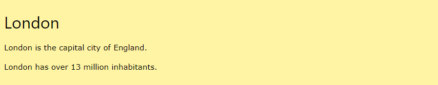

# Div elementi

## <mark style="color:green;">`<div>`</mark> <mark style="color:green;">elementi</mark>

<mark style="color:red;">`<div>`</mark> elementi default tarzda blok element hisoblanadi, u mavjud barcha bo'sh joylarni to'liq egallab oladi.


```html
Lorem Ipsum <div>I am a div</div> dolor sit amet. 
```


<figure><figcaption></figcaption></figure>



<mark style="color:red;">`<div>`</mark> elementida talab qilinadigan atribut yo'q, lekin <mark style="color:red;">`style`</mark>, <mark style="color:red;">`class`</mark> va <mark style="color:red;">`id`</mark> kabi ixtiyor atributlarni berish mumkin.

## <mark style="color:green;">Konteyner sifatida</mark> <mark style="color:green;">`<div>`</mark>

<mark style="color:red;">`<div>`</mark> elementi ko'pincha veb-sahifa bo'limlarini birga guruhlash uchun ishlatiladi.


```html
<div>
  <h2>London</h2>
  <p>London is the capital city of England.</p>
  <p>London has over 13 million inhabitants.</p>
</div> 
```


<figure><figcaption></figcaption></figure>



## <mark style="color:green;">`<div>`</mark> <mark style="color:green;">elementini o'rtaga joylashtirish</mark>

Agar sizda kengligi 100% bo'lmagan <mark style="color:red;">`<div>`</mark> elementi bo'lsa va uni o'rtaga olib kelishni xohlasangiz, CSSning <mark style="color:red;">`margin`</mark> xususiyatini <mark style="color:red;">`auto`</mark> qiling.

```html
<style>
div {
  width:300px;
  margin:auto;
}
</style> 
```

<figure><figcaption></figcaption></figure>



## <mark style="color:green;">Bir qancha</mark> <mark style="color:green;">`<div>`</mark> <mark style="color:green;">elementlari</mark>

Bir sahifada bir nechta <mark style="color:red;">`<div>`</mark> konteynerlari bo'lishi mumkin.

```html
<div>
  <h2>London</h2>
  <p>London is the capital city of England.</p>
  <p>London has over 13 million inhabitants.</p>
</div>

<div>
  <h2>Oslo</h2>
  <p>Oslo is the capital city of Norway.</p>
  <p>Oslo has over 600.000 inhabitants.</p>
</div>

<div>
  <h2>Rome</h2>
  <p>Rome is the capital city of Italy.</p>
  <p>Rome has almost 3 million inhabitants.</p>
</div> 
```

<figure><figcaption></figcaption></figure>



## <mark style="color:green;">`<div>`</mark> <mark style="color:green;">elementlarini yonma yon joylashtirish</mark>

Veb-sahifalarni yaratishda ko'pincha ikki yoki undan ortiq <mark style="color:red;">`<div>`</mark> elementlarni yonma-yon qilish kerak bo'ladi, masalan:

<figure><figcaption></figcaption></figure>

Elementlarni yonma-yon tekislashning turli usullari mavjud, ularning barchasi ba'zi CSS uslublarini o'z ichiga oladi. Biz eng keng tarqalgan usullarni ko'rib chiqamiz:

## <mark style="color:green;">Float</mark>

CSSning <mark style="color:red;">`float`</mark> xususiyati dastlab <mark style="color:red;">`<div>`</mark> elementlarini yonma-yon joylashtirish uchun mo'ljallanmagan, lekin yillar davomida shu maqsadda foydalanilgan.

CSSning <mark style="color:red;">`float`</mark> xususiyati kontentni joylashtirish va formatlash uchun ishlatiladi va elementlar ustma ust emas, balki yonma-yon turishga imkon beradi.

```html
<style>
.mycontainer {
  width:100%;
  overflow:auto;
}
.mycontainer div {
  width:33%;
  float:left;
}
</style> 
```

<figure><figcaption></figcaption></figure>



## <mark style="color:green;">Inline-block</mark>

Agar <mark style="color:red;">`<div>`</mark> elementining <mark style="color:red;">`displey`</mark> xususiyatini <mark style="color:red;">`block`</mark>dan <mark style="color:red;">`inline-block`</mark>ga o'zgartirsangiz, <mark style="color:red;">`<div>`</mark> elementlari endi yonma-yon ko'rsatiladi.


```html
<style>
div {
  width: 30%;
  display: inline-block;
}
</style> 
```


<figure><figcaption></figcaption></figure>



## <mark style="color:green;">Flex</mark>

CSS Flexbox Layout moduli float yoki pozitsiyadan foydalanmasdan moslashuvchan tartib tuzilmasini shakllantirishni osonlashtirish uchun taqdim qilingan.

CSSning flex xususiyati ishlashi uchun <mark style="color:red;">`<div>`</mark> elementlarini boshqa <mark style="color:red;">`<div>`</mark> elementi bilan o'rab oling va undan flexli konteyner sifatida foydalaning.


```html
<style>
.mycontainer {
  display: flex;
}
.mycontainer > div {
  width:33%;
}
</style> 
```


<figure><figcaption></figcaption></figure>



## <mark style="color:green;">Grid</mark>

CSSning Grid Layout moduli qatorlar va ustunlar bilan gridga asosidagi layout tizimini taklif etadi, bu esa <mark style="color:red;">`float`</mark> va pazitsiyalashdan foydalanmasdan turib veb-sahifalarni yaratishni osonlashtiradi.

Flex bilan deyarli bir xildek eshitiladi, lekin bir nechta qatorni tanlash va har bir qatorni alohida joylashtirish qobiliyatiga ega.

CSSning grid usuli sizdan <mark style="color:red;">`<div>`</mark> elementlarini boshqa <mark style="color:red;">`<div>`</mark> elementi bilan o'rash va grid konteyner holatiga ekltirishni talab qiladi va siz har bir ustunning kengligini belgilashingiz kerak.


```html
<style>
.grid-container {
  display: grid;
  grid-template-columns: 33% 33% 33%;
}
</style> 
```


<figure><figcaption></figcaption></figure>



## HTML teglari

| Tag                                                   | Description                            |
| ----------------------------------------------------- | -------------------------------------- |
| [\<div>](https://www.w3schools.com/tags/tag\_div.asp) | Sahifada bo'lim yaratish (block-level) |
